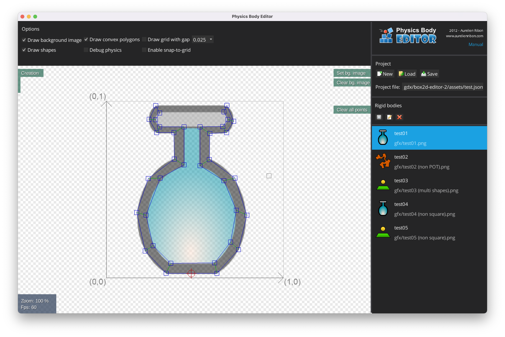

# Physics Body Editor
Physics Body Editor is originally developed by [Aurelien Ribon](http://www.aurelienribon.com/) and maintained by [MovingBlocks](https://github.com/MovingBlocks/box2d-editor) for libGDX loader.

**I rewrote entire SwingUI stuffs with Scene2d ([VisUI](https://github.com/kotcrab/vis-ui)) because of LWJGL3 AWT support issue([#6247](https://github.com/libgdx/libgdx/pull/6247)) and to work on Apple Silicon macs. Hope you guys useful on it ...**


<p align="center"></p>

Introduction
--------

Physics Body Editor is all about making your life easier with physics engines. Specifically, it targets the creation of collision shapes for your game objects: we call them rigid bodies. It can also let you combine these objects together and link them with joints to create complex objects: we call them dynamic objects.

The problem we want to solve is as follows: have a look at the image on the right, I wanted to create a bottle that can hold objects inside it. At first, I used a drawing tool to draw my shape points over the bottle image, and I reported the values in my game. For each point, I had to convert from pixel units to world units of course. Boring. Oh, and guess what? It didn’t work! Indeed, physics engines usually only work with convex polygons! On to decompose the shape into multiple convex polygons by hand… More than boring. And of course, each time I wanted to do a little change, I had to go over the same process.

I guess you understand why such automated tool can be handy: it converts pixel units to world units, decomposes the shape into multiple convex polygons, and lets you test the result directly!
Features

* Automatically decomposes concave shapes into convex polygons,
* Automatically traces your images if needed,
* Supports multiple outlines for a single body,
* Supports polygon and circle shapes,
* Reference point location can be changed,
* Visual configurable grid with snap-to-grid option,
* Built-in collision tester! Throw balls at your body to test it,
* Simple export format (JSON), to let you create your own loader for any framework in any language.

Getting Started
--------
Download latest [Physics Body Editor](https://github.com/phyohtetarkar/box2d-editor-2/releases/latest/download/PhysicsBodyEditor-2.jar).

* [Wiki](https://github.com/MovingBlocks/box2d-editor/wiki)
* [YouTube](https://youtu.be/KASY91EiTXQ)

```bash
# Run on Mac requires -XstartOnFirstThread

java -jar -XstartOnFirstThread PhysicsBodyEditor-2.jar
```

As for loader you can reuse old [LibGDX Java loader](https://github.com/julienvillegas/box2d-editor/blob/develop/downloads/BodyEditorLoader.java). Check out [LibGDX.info](https://libgdxinfo.wordpress.com/box2d-importing-complex-bodies/) for code sample!


Technologies
--------

The application uses the following technologies:

* [LibGDX](https://github.com/libgdx/libgdx), the most awesome game dev library, for the rendering of the canvas area,
* [Box2d](http://box2d.org/), as the embedded physics engine (available in Java thanks to libGDX),
* [Farseer engine](https://github.com/tinco/Farseer-Physics), for its auto-trace and polygon decomposition algorithms.
